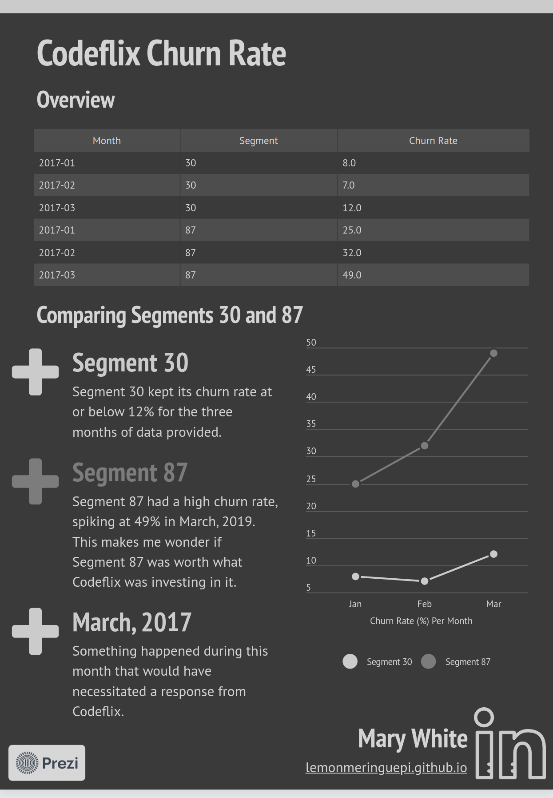

# Churn Rate with Codeflix

A SQL project on churn rate using data from Codeflix.

## Table of Contents

* [Introduction](#introduction)
* [Technologies](#technologies)
* [Presentation](#presentation)
* [Sources](#sources)

## Introduction

This project analyzes churn data from a table titled *subscriptions*. The columns are as follows:

- id
- subscription_start
- subscription_end
- segment

SQL queries are used to explore the data and calculate churn for segments 30 and 87 between January and March, 2017.

## Technologies

* SQL
* Prezi

## Presentation

The SQL queries, as well as a screenshot of the resulting tables, can be found as attachments to this repository. [Click here to be redirected to the full, interactive presentation of data on Prezi.](https://prezi.com/i/0ishad6cuwkm/codeflix-churn-rate/) Below is a sample image without interactivity:

## Sources

This project can be found on [Codecademy](https://www.codecademy.com)'s SQL course. The dataframe was generously made available by [Codeflix](https://www.codeflix.com.au/).

I used [Prezi](https://www.prezi.com) to create and host the report with my findings.